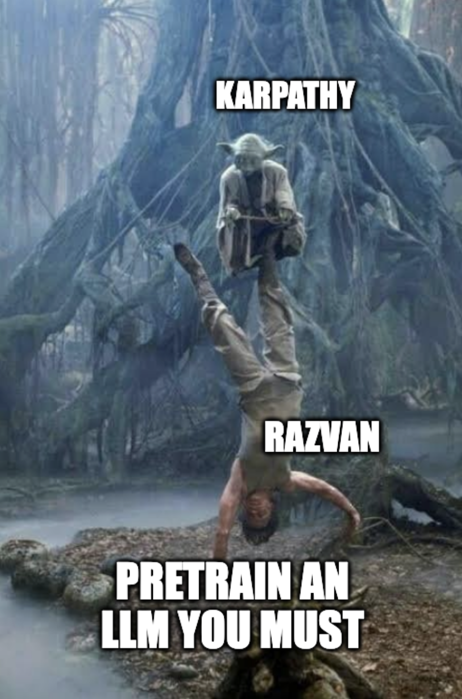
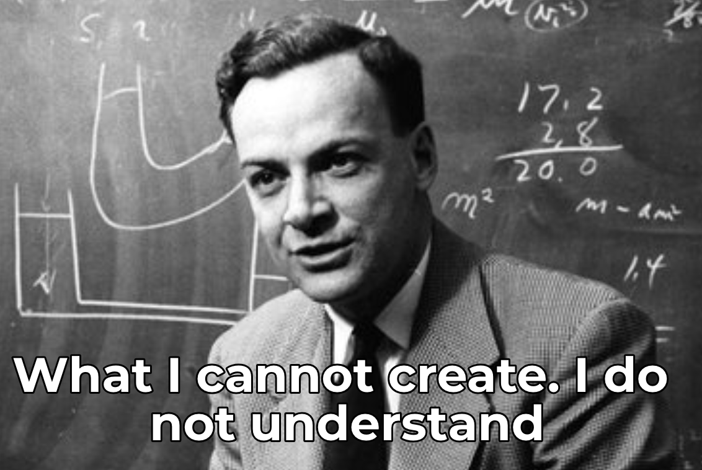
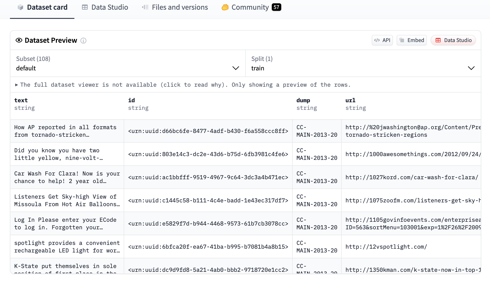
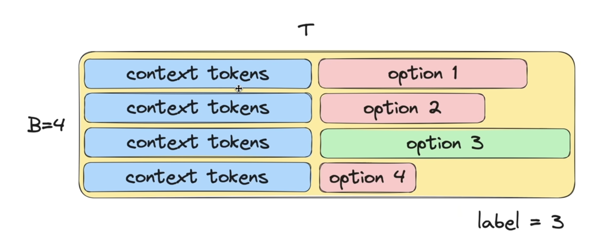
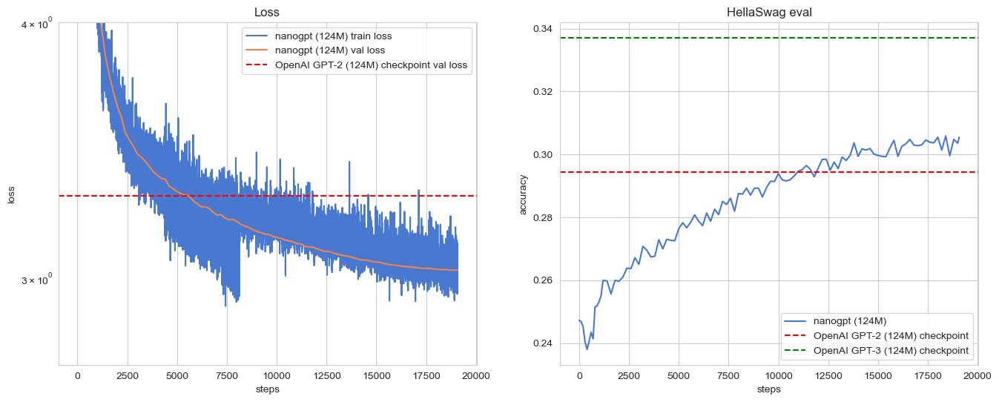

# Reproducing-GPT2-small

<p align="center">
    
    
</p>

Large Language Models (LLMs) can seem like dark magic. The idea of training a model like GPT2 might feel overwhelming, especially with all the hype and complexity surrounding the newest enterprise models. However, the best way to understand LLMs is to build one yourself.

This project is my own reimplementation of Andrej Karpathy’s work on [nanoGPT](https://github.com/karpathy/nanoGPT/tree/master), breaking down the concepts into something approachable and practical for myself. By recreating GPT-2 step by step, I aim to gain a deeper understanding of how these models function under the hood.

## GPT2

We reimplemented the GPT2-small architecture according to the [repository](https://github.com/openai/gpt-2) and the [paper](https://cdn.openai.com/better-language-models/language_models_are_unsupervised_multitask_learners.pdf) released by OpenAI. The gpt2.py file contains the PyTorch implemantations of the GPT2 model which is mostly inspired by Karpathy's [build nanoGPT](https://github.com/karpathy/build-nanogpt) project. To verify the correctness of our architecture implementation, we load the pretrained weights from HuggingFace’s [GPT2LMHeadModel](https://huggingface.co/docs/transformers/v4.49.0/en/model_doc/gpt2#transformers.GPT2LMHeadModel) and ensure that the model behaves as expected.

For a visual interpretation of GPT2-small, explore the following [link](https://bbycroft.net/llm).

## FineWeb 

Unlike the original paper, which used [CommonCrawl](https://commoncrawl.org/) - dataset known for its large size but also significant noise—we prioritize data quality over quantity by using [FineWeb-edu](https://huggingface.co/spaces/HuggingFaceFW/blogpost-fineweb-v1).

FineWeb-Edu is a high-quality dataset curated for pretraining large language models (LLMs), focusing on educational content. For GPT2-small we use FineWeb-Edu-10B. The script for processing the shards (fineweb.py) is exactly the same like the one in the [build nanoGPT](https://github.com/karpathy/build-nanogpt) project.
<p align="center">
    
</p>

We split the 10B tokens into shards and we load them gradually during the training in the data loader. 

## HellaSwag


[HellaSwag](https://arxiv.org/pdf/1905.07830) offers a smooth evaluation signal and provides early indicators of progress, even for smaller models like ours.

During training, we periodically evaluate on HellaSwag. For each example, we shift the tokens so that the model’s loss is computed only over the candidate continuation portion of each option. The option with the lowest loss is then selected as the model’s prediction.

<p align="center">
<figure align="center">
    
    <figcaption>HellaSwag Example from Andrej Karpathy's video lecture</figcaption>
</figure>
</p>

## Pre-training

For pre-training, we used the same architecture size and hyper-parameters as presented in the [GPT3 paper](https://arxiv.org/pdf/2005.14165) (apparently GPT3 has more information regarding the experimental methodology than the original GPT2 paper). 

We ran the experiment on an RTX 4090 for about 48 hours on a cloud provider similar to Google Cloud Platform (GCP) and Amazon Web Services (AWS).  We monitored the loss as well as the norm to make sure that the network is stable during training. 

Since the training can take a lot of time, we implemented a checkpoint feature to resume the training. While resuming a checkpoint, we load the model and the optimizer state dictionaries. At the same time, the data loader iterates through the shards until it reaches the position of the next batch with respect to the current step. We monitor the training by logging the data periodically in Weights & Biases. 

There is a config.yaml file where you can set up the path to the last checkpoint, the path to the data shards and  the parameters for wandb.

After 19k steps, we have the following results:
 
* Min Train Loss: 2.908273
* Min Validation Loss: 3.0283
* Max Hellaswag eval: 0.3059

The [final weights](https://huggingface.co/Razvanip/nanoGPT2-124m) can be downloaded in the HuggingFace hub 🤗

<p align="center">
    
</p>


## TODOs

* Post-train the current model with OpenAssistant dataset to execute commands. 
* Optimize the training process through GPU parallelization 

## Some final notes

I had a lot of fun reimplementing GPT2 from scratch and I definitely learned more about LLMs from an experimental point of view :)  (especially optimization tricks). I wholeheartedly encourage everyone to watch Andrej Karpathy's [video](https://www.youtube.com/watch?v=l8pRSuU81PU) (and his other golden gem videos) and try to reproduce GPT2 yourselves. It's a good exercise for those who want to become Research Engineers. 

LLMs are definitely not a job for a single person: there a lot of aspects during the process of pretraining which cannot always be handled by one person (no longer surprised why there are over 50 names for every new LLM release).

For the next project, we might explore some VLMs. 

I feel really grateful to Andrej Karpathy for all the work he does in the AI commumity. His lectures turned my knowledge about LLMs from a blackbox to something that I can grasp and experiment with on my own. In just two months, he became one of my favourite figures in the AI field ^^.

## Requirements 

```
pip install requirements.txt
```